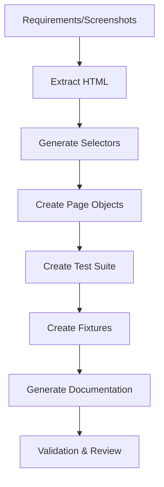

# AI Workflow: Test Creation & Migration Guide

## Purpose

This document guides AI assistants (GitHub Copilot, Claude Sonnet, OpenCode) on how to create and migrate Cypress tests for the DocumentHub platform.

---

## Workflow Overview



---

## Step-by-Step Process

### Step 0: Chat Intake (Mandatory)

Before any coding, ask and lock these decisions:

1. Role:

- `ai/roles/senior-cypress-engineer.md`
- `ai/roles/senior-cypress-responsive.md`
- `ai/roles/frontend-developer.md`

2. Task Mode:

- Create new test
- Migrate existing test

3. Target suite and files in scope
4. Whether QA docs must be updated in the same run

Routing:

- If mode is Create new test, load `ai/prompts/creation/create-new-test.md`.
- If mode is Migrate existing test, load `ai/prompts/migration/migrate-registration-test.md`.

Only after Step 0 is complete, continue with Step 1.

### Step 1: Requirements Analysis

**Input:**

- User story or feature description
- Screenshots of UI (if available)
- HTML source of target page
- Existing similar tests (for pattern reference)

**AI Task:**

- Identify test scenarios (happy path, validations, error cases)
- List required test data
- Note any assumptions

**Output:**

- Test scenario list
- Required fixtures identified
- Assumptions documented

---

### Step 2: HTML & Selector Extraction

**Input:**

- Screenshot of page
- HTML source from browser DevTools

**AI Task:**

1. Store HTML in `ai/html/[feature-name].html`
2. Analyze DOM structure
3. Extract stable selectors (prefer: `name`, `aria-label`, `id`)
4. Create selector file with grouping
5. Support bilingual (EN/DE) patterns

**Output File:** `cypress/support/selectors/[feature].selectors.js`

**Example:**

```javascript
export const featureSelectors = {
  form: 'form[aria-label="registration form"]',
  inputs: {
    email: 'input[name="email"]',
    password: 'input[name="password"]',
  },
  buttons: {
    submit: 'button[type="submit"]',
  },
};
```

---

### Step 3: Page Object Creation

**Input:**

- Selectors file from Step 2
- User interaction flow

**AI Task:**

1. Create class-based Page Object
2. Add JSDoc for each method
3. Implement method chaining pattern
4. Add error handling
5. Support bilingual text matching

**Output File:** `cypress/support/pages/[Feature]Page.js`

**Template:**

```javascript
/**
 * Page Object: [Feature Name]
 * Purpose: [Description]
 * AI-Generated: [Date]
 */
import { featureSelectors as selectors } from '../selectors/[feature].selectors';

export class FeaturePage {
  visit() {
    cy.visit(Cypress.env('dh_baseUrl') + '/path');
    return this;
  }

  fillField(data) {
    cy.get(selectors.inputs.field).should('be.visible').clear().type(data);
    return this;
  }

  submit() {
    cy.get(selectors.buttons.submit).click();
    return this;
  }

  verifySuccess() {
    cy.get(selectors.successMessage)
      .should('be.visible')
      .invoke('text')
      .should('match', /success|erfolgreich/i);
    return this;
  }
}

export default new FeaturePage();
```

---

### Step 4: Test Suite Creation

**Input:**

- Page Objects
- Test scenarios list
- Fixture data

**AI Task:**

1. Create describe block with clear naming
2. Write individual it() blocks for each scenario
3. Use Page Objects (not direct cy.get)
4. Add test metadata (source, AI-generated, date)
5. Include both happy path and negative tests
6. Add proper waits with justification

**Output File:** `cypress/e2e/DH/EG/DH_EG_[XX]_[Feature]_TS.js`

**Template:**

```javascript
/**
 * TEST SUITE: [Feature Name]
 * Feature: [Description]
 * Migration Source: [E-gehaltszettel file or "New"]
 * AI-Generated: [Date]
 */

import FeaturePage from '../../support/pages/FeaturePage';

describe('DH_EG_[XX]_[Feature]_TS', () => {
  let testData;

  before(() => {
    cy.fixture('[feature]-data.json').then((data) => {
      testData = data;
    });
  });

  it('DH_01 - [Happy path description]', () => {
    FeaturePage.visit().fillField(testData.field).submit().verifySuccess();
  });

  it('DH_02 - [Validation test description]', () => {
    // Validation test
  });
});
```

---

### Step 5: Fixture Creation

**Input:**

- Required test data from scenarios

**AI Task:**

1. Create structured JSON fixture
2. Include valid data sets
3. Include invalid data for negative tests
4. Add metadata for traceability
5. Support multiple test users/scenarios

**Output File:** `cypress/fixtures/[feature]-data.json`

**Template:**

```json
{
  "validUser": {
    "field1": "value1",
    "field2": "value2",
    "metadata": {
      "createdDate": "2026-05-11",
      "scenario": "Happy Path"
    }
  },
  "invalidData": {
    "weakPasswords": ["test", "12345"],
    "invalidEmails": ["notemail", "@test"]
  }
}
```

---

### Step 6: Documentation Generation

**Input:**

- All created files
- Test scenarios
- Screenshots

**AI Task:**

1. Generate comprehensive Markdown documentation
2. Include feature scope, preconditions, test data
3. Document each test scenario with steps
4. Add automation notes (selectors, POM usage)
5. List open questions and gaps
6. Create source mapping table

**Output File:** `docs/features/DH_EG_[XX]_[Feature].md`

**Use template from:** `docs/features/DH_EG_04_Self_Registration.md`

**Required Sections:**

- Feature Overview
- Feature Scope
- Preconditions
- Test Data References
- Scenario Coverage Plan
- Detailed Scenarios (with steps)
- Automation Notes
- Open Questions and Gaps
- Source Mapping Appendix

---

### Step 7: Validation & Self-Check

**AI Task:**
Run through this checklist:

#### Code Quality

- [ ] No hardcoded waits without justification
- [ ] Proper error handling
- [ ] Selectors are stable (no nth-child)
- [ ] Bilingual support (EN/DE)
- [ ] JSDoc comments present
- [ ] Method chaining used

#### Test Coverage

- [ ] Happy path covered
- [ ] Validation tests included
- [ ] Error scenarios considered
- [ ] Fixtures created
- [ ] Documentation complete

#### Framework Compliance

- [ ] Page Objects used (not direct cy.get)
- [ ] Fixtures loaded properly
- [ ] Naming convention followed: `DH_EG_[XX]_[Feature]_TS`
- [ ] Selectors grouped and exported
- [ ] Custom commands used where appropriate

#### Documentation

- [ ] All scenarios documented
- [ ] Steps clearly described
- [ ] Expected results stated
- [ ] Sources referenced (HTML, screenshots)
- [ ] TODO items listed

---

## Migration-Specific Rules

### When Migrating from E-gehaltszettel

**Replace:**

- `cy.loginToSupportViewAdmin()` → `cy.loginToDH()`
- E-gehaltszettel selectors → DH selectors
- Support View navigation → Direct page navigation
- XML uploads → Form interactions

**Preserve:**

- Business logic and validations
- Assertion patterns
- Yopmail email workflow
- Credential extraction logic
- Test flow structure

**Example Migration:**

**Before (E-G):**

```javascript
cy.loginToSupportViewAdmin();
cy.get('#searchButton>span').click();
cy.get('.search-dialog>form>.form-fields>.searchText-wrap')
  .eq(0)
  .type(Cypress.env('company'));
```

**After (DH):**

```javascript
cy.loginToDH();
SearchPage.searchCompany(Cypress.env('company'));
```

---

## AI Prompt Examples

### For New Test Creation

```
Create a Cypress test for DH user password reset feature.

Inputs:
- Screenshot: [attached]
- HTML: [pasted]
- Requirements: User enters email, receives reset link, sets new password

Generate:
1. Selectors file
2. Page Object
3. Test suite with happy path and validations
4. Fixture data
5. Documentation
```

### For Test Migration

```
Migrate this E-gehaltszettel test to DH:
- Source: R06_Create_User_from_CSV.js
- DH HTML: [attached]
- New workflow: Direct admin UI instead of CSV upload

Preserve: Validation logic, assertions
Replace: Upload mechanism, selectors
```

---

## Output Quality Standards

### Excellent AI Output ✅

- Uses Page Objects exclusively
- Selectors are stable and maintainable
- Documentation is comprehensive
- Fixtures are well-structured
- Bilingual support implemented
- Error handling present
- TODOs clearly marked

### Poor AI Output ❌

- Direct `cy.get()` everywhere
- Hardcoded waits: `cy.wait(5000)`
- No documentation
- Unstable selectors (nth-child)
- Missing error handling
- No bilingual support
- No fixture usage

---

## Continuous Improvement

After each AI-generated test:

1. **Review:** Human QA reviews output
2. **Execute:** Run test to validate
3. **Feedback:** Note what worked/failed
4. **Update Prompts:** Improve this guide based on learnings

---

## Tools & Extensions

### Recommended VS Code Setup

- **GitHub Copilot:** Inline code suggestions
- **Claude Sonnet:** Complex refactoring & documentation
- **OpenCode:** Test planning and architecture

### AI Context Files to Provide

- `ai/context/framework-context.md`
- `ai/context/migration-rules.md`
- `ai/html/[feature].html`
- `ai/screenshots/[feature].png`
- Existing similar tests for pattern reference

---

## Success Metrics

**AI-Generated Test Quality:**

- ✅ 95%+ selector stability
- ✅ 100% Page Object usage
- ✅ Full documentation coverage
- ✅ Zero hardcoded waits
- ✅ Bilingual support
- ✅ Fixture-driven data

---

**Last Updated:** 2026-05-11  
**Maintained By:** QA Automation Team  
**Version:** 1.0
